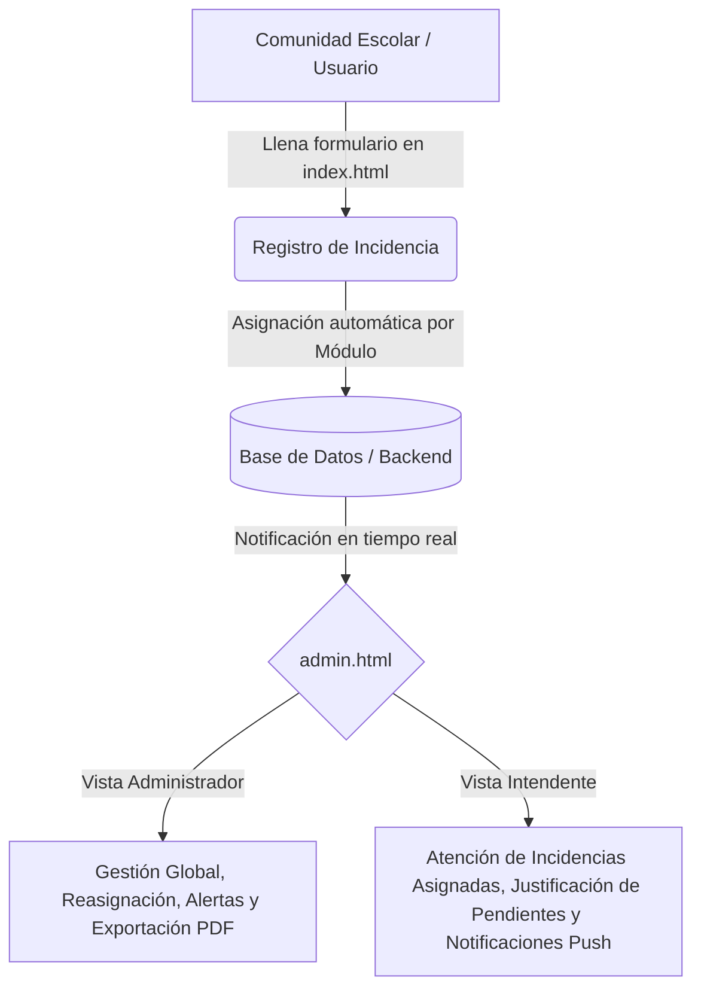
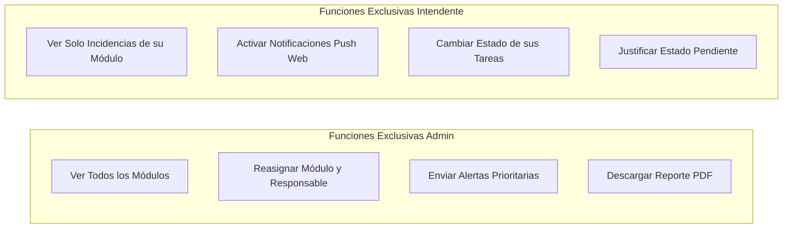

# Manual de Usuario: Sistema de Gestión y Control de Incidencias (ESTi)

**Institución:** ESTi  
**Proyecto:** Sistema de Gestión y Control de Incidencias  
**Desarrollador:** Daniel Camilo García Galicia  
**Carrera:** Licenciatura en Tecnologías de la Información  
**Versión:** 2.0  

---

## 1. Introducción y Propósito del Sistema

El **Sistema de Gestión y Control de Incidencias ESTi** es una plataforma web integral diseñada para optimizar, centralizar y dar seguimiento en tiempo real al mantenimiento e incidencias reportadas en las instalaciones escolares (aulas, módulos, baños, laboratorios y áreas comunes).

### Objetivos Clave:
1. **Facilitar el reporte rápido** de fallas por parte de alumnos, docentes y personal general sin necesidad de registros complicados.
2. **Asignación automática y transparente** de responsables de intendencia según el módulo o edificio donde ocurre la falla.
3. **Seguimiento operativo en tiempo real** mediante estados claros (*En curso*, *Pendiente*, *Completado*, *Baja*, *En revisión*).
4. **Control técnico de aplazamientos** exigiendo motivos justificados cuando un reporte no puede concluirse de inmediato.
5. **Comunicación prioritaria y alertas** directas entre la Administración y el personal de intendencia.

---

## 2. Perfiles y Roles de Usuario

El sistema contempla tres niveles de interacción:

| Perfil | Acceso | Permisos y Alcance |
| :--- | :--- | :--- |
| **Comunidad Escolar (Público)** | `index.html` (Sin login) | Registro de nuevas incidencias, selección de ubicación, descripción y carga opcional de evidencia fotográfica. |
| **Intendente** | `admin-login.html` &rarr; `admin.html` | Visualización **exclusiva** de los reportes asignados a su módulo; actualización de estados de trabajo; registro de justificaciones en caso de estado *Pendiente*; recepción de alertas y notificaciones push. |
| **Administrador** | `admin-login.html` &rarr; `admin.html` | Supervisión global de todos los módulos; reasignación de edificios y responsables; emisión de alertas prioritarias a intendentes; descarga exclusiva de reportes en PDF; monitoreo de KPIs. |

---

## 3. Módulo 1: Portal Público de Reportes (`index.html`)

Este portal es la puerta de entrada para cualquier persona que detecte una anomalía en las instalaciones.

### 3.1. Campos del Formulario

1. **Tu nombre completo** *(Obligatorio)*:
   - Nombre de la persona que reporta la anomalía (para fines de seguimiento y aclaraciones).
2. **Tipo de espacio** *(Obligatorio)*:
   - Opciones: `Aula`, `Baño`, `Otro`.
   - **Comportamiento dinámico e inteligente**:
     - Al seleccionar **Aula**: se despliega el selector de **Módulo / Edificio** (`Módulo 1`, `Módulo 2`, `Módulo 3`, `Módulo 4`, `Módulo 5`, `Laboratorios`).
     - Al seleccionar **Baño**: se despliegan automáticamente los selectores de **Módulo**, **Género del baño** (`Baño de hombres`, `Baño de mujeres`) y **Piso** (`Planta alta`, `Planta baja`).
     - Al seleccionar **Otro**: los selectores complementarios se ocultan para mantener el formulario simple.
3. **Ubicación específica o referencia** *(Recomendado)*:
   - Campo de texto libre para detallar puntos exactos (ej. *"Aula 302 junto al proyector"* o *"Baño de mujeres frente a las escaleras"*). El texto guía de ayuda se adapta según el tipo de espacio elegido.
4. **Descripción de la anomalía** *(Obligatorio)*:
   - Explicación clara de la avería (fugas de agua, focos fundidos, chapas dañadas, vidrios rotos, etc.).
5. **Evidencia fotográfica** *(Opcional)*:
   - Permite tomar una fotografía directamente desde la cámara del celular o seleccionar un archivo de imagen (JPG, PNG, WEBP) de hasta 2 MB.
   - Muestra una **vista previa instantánea** con opción de descartar o cambiar la imagen antes de enviar.

### 3.2. Proceso de Envío
- Al hacer clic en **"Enviar reporte"**, el botón muestra un indicador de carga para evitar registros duplicados.
- El sistema guarda la incidencia, calcula al responsable inicial según el módulo y notifica a los paneles activos.
- El formulario se reinicia automáticamente y muestra un mensaje de confirmación en verde y una notificación toast flotante.

---

## 4. Módulo 2: Acceso al Sistema (`admin-login.html`)

Para acceder al área de gestión, se ingresa mediante el botón **"Acceso Admin"** o navegando a `admin-login.html`.

### 4.1. Pasos para Iniciar Sesión

1. **Seleccionar Perfil**:
   - El usuario hace clic en una de las dos pestañas superiores: **Administrador** o **Intendente**.
2. **Ingreso como Administrador**:
   - Se introduce la contraseña maestra de administración.
   - Se presiona **"Ingresar al Panel"**.
3. **Ingreso como Intendente**:
   - Al marcar la pestaña *Intendente*, aparece el desplegable **"Nombre del intendente"**.
   - Se selecciona el nombre propio de la lista (Hermelinda, Maika, Liliana, Diego, Anita, Ricardo, Oscar, Cynthia, Gabriela, Jesus, Sotero).
   - Se introduce la contraseña personal correspondiente al intendente seleccionado.
   - Se presiona **"Ingresar al Panel"**.

> [!NOTE]
> La sesión se almacena de forma segura en `sessionStorage`. Al cerrar la pestaña o pulsar "Cerrar sesión", las credenciales se eliminan automáticamente.

---

## 5. Módulo 3: Panel de Control y Seguimiento (`admin.html`)

El panel adapta su interfaz y herramientas en función del rol con el que se haya iniciado sesión.

### 5.1. Barra Superior y Encabezado
- **Identificador de Rol**: En la parte superior se visualiza una insignia interactiva con punto verde pulsante que indica claramente:
  - `Administrador` para el encargado general.
  - `Intendente: [Nombre]` para el personal operativo.
- **Botón "Ir a reporte"**: Permite abrir en una pestaña el formulario de captura pública.
- **Botón "Cerrar sesión"**: Finaliza de inmediato la sesión y redirige al inicio.

### 5.2. Métricas y KPIs de Rendimiento
En la parte superior se presentan 5 tarjetas estadísticas que se actualizan en tiempo real:
1. **Total Reportes**: Conteo de incidentes visibles para el usuario en sesión.
2. **Completados**: Casos resueltos satisfactoriamente (indicador verde esmeralda).
3. **Pendientes**: Casos en pausa que cuentan con justificación técnica (indicador ámbar).
4. **Recientes**: Conteo de actividad registrada en los últimos reportes.
5. **Última Fecha**: Marca temporal del reporte más reciente registrado.

### 5.3. Filtros y Herramientas
- **Filtro por Mes**: Desplegable dinámico que agrupa las incidencias por mes y año para consultar históricos o períodos específicos.
- **Descargar Reporte PDF** *(Solo Administrador)*:
  - Genera una vista ejecutiva imprimible lista para exportar a PDF o enviar a impresora física con el resumen filtrado del mes.
  - **Restricción de seguridad:** Este botón y su función están completamente bloqueados y retirados del panel de los intendentes.

### 5.4. Tabla Interactiva de Incidentes

| Columna | Descripción y Comportamiento |
| :--- | :--- |
| **Fecha** | Fecha y hora en formato legible en que se emitió el reporte. |
| **Nombre** | Nombre del reportante original. |
| **Tipo** | Categoría del espacio (`Aula`, `Baño (Hombres - Planta alta)`, etc.). |
| **Módulo / Edificio** | En modo **Admin**, es un desplegable editable para reasignar el módulo. En modo **Intendente**, es una etiqueta fija no modificable. |
| **Ubicación** | Punto de referencia específico ingresado por el usuario. |
| **Descripción** | Detalle de la falla o anomalía reportada. |
| **Evidencia** | Miniatura de la fotografía adjunta. Al hacer clic sobre ella, se abre el **visor a pantalla completa**. Si no hay foto, muestra *"Sin foto"*. |
| **Estado** | Selector con colores interactivos: `En curso`, `Completado`, `Pendiente`, `Baja`, `En revisión`. |
| **Motivo de Pendiente** | Se activa cuando el estado es `Pendiente`. Muestra una tarjeta con la justificación, autor y fecha, junto con un botón para **Editar** o **Agregar**. Si el estado es otro, muestra un guion (`—`). |
| **Responsable** | En modo **Admin**, permite reasignar al intendente. En modo **Intendente**, aparece en modo solo lectura. |
| **Alerta** *(Solo Admin)* | Botón para enviar o reenviar un aviso urgente al intendente asignado. |

---

## 6. Funcionalidades Especiales y Flujos Operativos

### 6.1. Flujo de Justificación de Incidencias en Estado "Pendiente"
Cuando un intendente o administrador cambia el estado de una incidencia a **Pendiente**, el sistema requiere una justificación técnica para garantizar la rendición de cuentas:

1. Al seleccionar *Pendiente* en la tabla, se abre automáticamente el **Modal de Justificación Técnica**.
2. El modal muestra el módulo y la descripción del problema para dar contexto.
3. El usuario puede hacer clic en cualquiera de las **Sugerencias Rápidas**:
   - 📦 *Falta refacción / material*
   - 📋 *Esperando autorización*
   - 🔧 *Requiere apoyo externo*
   - 🚫 *Sin acceso temporal*
   - ⏳ *Turno siguiente*
4. O bien, escribir detalladamente en el área de texto (hasta 500 caracteres).
5. Al presionar **"Guardar y registrar motivo"**:
   - El estado se actualiza a *Pendiente*.
   - La tabla genera la tarjeta ámbar con la justificación, el nombre de quién lo registró y la hora exacta.
   - Si se presiona *Cancelar*, el selector de estado vuelve al valor previo.

### 6.2. Flujo de Emisión de Alertas Prioritarias (Administrador)
1. En la fila del incidente, el Administrador hace clic en **"Enviar alerta"** (o *"Reenviar alerta"*).
2. Se despliega el **Modal de Alerta Prioritaria** con el nombre y avatar del intendente asignado.
3. El Administrador puede elegir una plantilla rápida:
   - 🚨 *Revisión urgente*
   - 🛠️ *Atender a la brevedad*
   - 📋 *Solicitar informe*
   - 🧹 *Limpieza prioritaria*
   - 📦 *Verificar refacciones*
4. O escribir un mensaje particular (hasta 300 caracteres).
5. Al pulsar **"Enviar Alerta"**:
   - Se guarda el mensaje con fecha y hora.
   - Se despacha una notificación push al dispositivo del intendente (si está configurado).
   - En la pantalla del intendente activo, aparece de inmediato una notificación toast con el mensaje recibido.

### 6.3. Activación de Notificaciones Push Web (Intendentes)
1. El intendente ingresa a su panel en su computadora o teléfono celular.
2. En la barra superior presiona el botón naranja **"Activar notificaciones"**.
3. El navegador solicitará permisos de notificación; el usuario debe presionar **"Permitir"**.
4. Una vez concedido, el botón cambiará a *"Notificaciones activas"* en verde.
5. A partir de ese momento, el intendente recibirá las alertas enviadas por el Administrador incluso si tiene la pestaña cerrada.

---

## 7. Matriz Oficial de Módulos y Responsables

El sistema asigna por defecto al primer responsable del módulo, pero permite que los demás intendentes del mismo edificio tomen la tarea si es necesario:

| Módulo / Edificio | Personal Asignado |
| :--- | :--- |
| **Módulo 1** | Hermelinda, Maika, Sotero |
| **Módulo 2** | Liliana, Diego, Sotero |
| **Módulo 3** | Anita, Ricardo, Sotero |
| **Módulo 4** | Oscar, Cynthia, Sotero |
| **Módulo 5** | Gabriela, Jesus, Sotero |
| **Laboratorios** | Gabriela, Jesus, Sotero |

---

## 8. Preguntas Frecuentes y Solución de Problemas

### ¿Por qué como intendente no veo el botón de descargar PDF?
> **Respuesta:** Por política operativa y de seguridad, la generación y descarga de reportes oficiales consolidados está restringida exclusivamente al perfil de **Administrador**.

### ¿Qué sucede si se interrumpe la conexión al servidor?
> **Respuesta:** El sistema cuenta con persistencia híbrida. Si la API remota o base de datos no está disponible temporalmente, los datos se almacenan en el almacenamiento local del navegador (`localStorage`) para que ninguna incidencia se pierda.

### ¿Cómo puedo ver con más claridad la fotografía de una avería?
> **Respuesta:** Simplemente haz clic sobre la miniatura en la columna *Evidencia*. Se abrirá un visor flotante en alta resolución. Para cerrarlo, haz clic en la "X" superior o en cualquier parte fuera de la imagen.

### ¿Se pueden editar las justificaciones de un reporte pendiente?
> **Respuesta:** Sí. En la tarjeta de la columna *Motivo de Pendiente*, haz clic en el botón **"Editar"** para actualizar la explicación o cambiar el motivo cuando surjan novedades.

---

*Manual elaborado para el Sistema de Reporte y Control de Incidencias ESTi.*  
*Diseñado bajo estándares de diseño Tailwind CSS y arquitectura modular web.*
